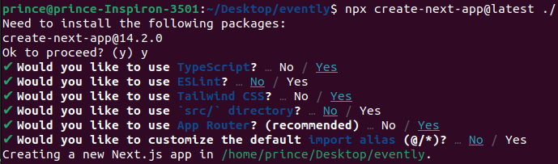
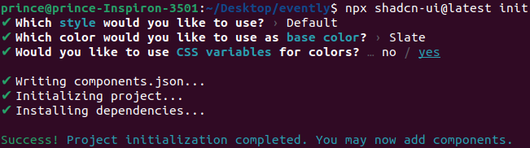

# Project Setup

- Create a Next JS App

```cmd
mkdir evently
npx create-next-app@latest ./
npm run dev
```



- Install Shadcn UI library

```cmd
npx shadcn-ui@latest init
```



- Install a `button` component

```cmd
npx shadcn-ui@latest add button
```
